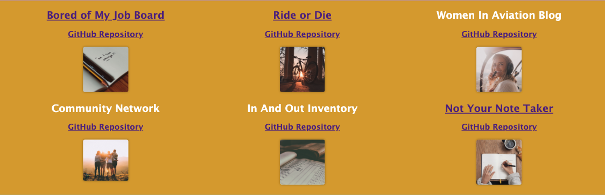

# Meet Bailey
## Description
This project aims to create a single-page application portfolio for web developers using React. The main motivation behind this project is to provide employers with a way to view a potential employee's deployed React portfolio of work samples. The portfolio allows employers to assess whether a candidate is a good fit for an open position.

The portfolio consists of a header, a section for content, and a footer. The header contains the developer's name and navigation with titles corresponding to different sections of the portfolio. The navigation titles include About Me, Portfolio, Contact, and Resume, and the title corresponding to the current section is highlighted. When a navigation title is clicked, the corresponding section is presented below the navigation without the page reloading, and that title is highlighted.

The About Me section includes a recent photo or avatar of the developer and a short bio about them. The Portfolio section includes titled images of six of the developer's applications with links to both the deployed applications and the corresponding GitHub repository. The Contact section includes a contact form with fields for a name, an email address, and a message. The Resume section includes a link to a downloadable resume and a list of the developer's proficiencies.

## Table of Contents

- [Installation](#installation)
- [Usage](#usage)
- [Credits](#credits)
- [License](#license)

## Installation
To install and run this project on your local machine, follow these steps:

Clone the repository to your local machine using the following command:

`git clone <https://github.com/skyeflier/meet-bailey>`
Navigate to the project directory.

`cd react-portfolio`
Install the required dependencies.

`npm install`
Start the development server.

`npm start`
Open your web browser and go to http://localhost:3000 to view the portfolio.

## Usage
To use this portfolio, click on the navigation titles to view the corresponding sections of the portfolio. The About Me section includes a recent photo or avatar of the developer and a short bio about them. The Portfolio section includes titled images of six of the developer's applications with links to both the deployed applications and the corresponding GitHub repository. The Contact section includes a contact form with fields for a name, an email address, and a message. The Resume section includes a link to a downloadable resume and a list of the developer's proficiencies.

## Credits
This project was built by Bailey.

## License
This project is licensed under the MIT license.